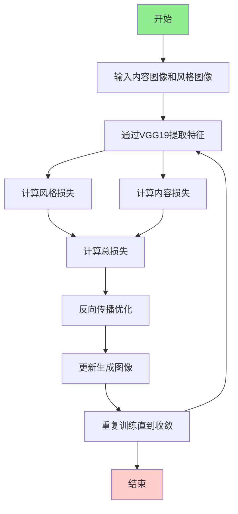

```mermaid
graph TD
    A[开始] --> B[输入内容图像和风格图像]
    style A fill:#90EE90
    B --> C[通过VGG19提取特征]
    C --> D[计算内容损失]
    C --> E[计算风格损失]
    E --> F
    D --> F[计算总损失]
    F --> G[反向传播优化]
    G --> H[更新生成图像]
    H --> I[重复训练直到收敛]
    I --> C
    I --> J[结束]
    style J fill:#FFCCCB
```